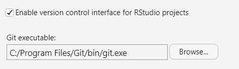
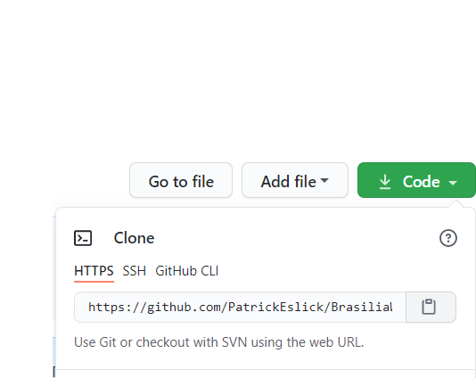
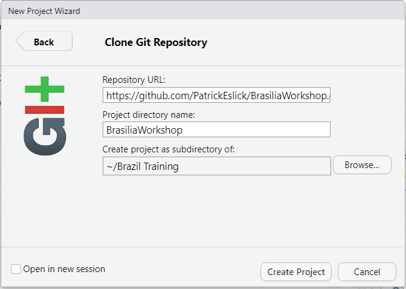
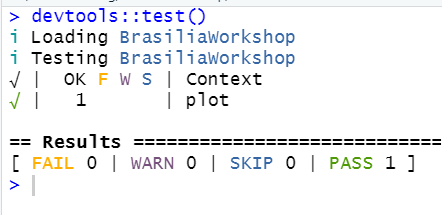
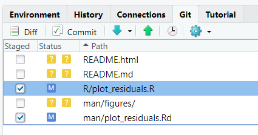
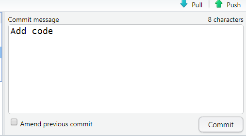

# Brasilia Workshop Git/Package Practice

## Steps
* Make sure you have Git installed and set up in RStudio
  + In RStudio, select Tools > Global Options... > Git/SVN
  + You should see a path to git.exe listed under "Git executable:".  

* Install these packages
  + devtools
  + testthat
  + usethis
  + roxygen2
```
install.packages(c("devtools", "testthat", "usethis", "roxygen2"))
```
* Fork this repository to your GitHub account
  + Make sure you're logged in to your GitHub account.
  + Click "Fork" in the upper-right corner of this repository.   
.  
* Clone this respository to your computer with a new RStudio Project.
  + In GitHub, select the menu from the "Code" button, select HTTPS, and copy the URL to the clipboard by clicking the clipboard icon.  

  + In RStudio, select File > New Project > Version Control > Git.
  + Copy the URL into the "Repository URL:" box.  

* Fill in the plot_residuals code and documentation.
  + In RStudio, in the R directory, open the "plot_residuals.R" script.
  + Using the comments to guide you, fill in the code for the plot_residuals function.
  + Add some details to the documentation of the function.
  + Update the documentation using this command.
```
devtools::document()
```
* Make sure that the tests work
  + If you have filled in code that produces a ggplot object, the tests built-in to the package should now pass. To verify this, use the following command.
```
devtools::test()
```
  + You should see 1 test listed next to "PASS" and 0 next to "FAIL".  

* Commit your changes.
  + In the "Git" tab, stage your files for commit by checking the box next to the files you've modified. This should be "R/plot_residuals.R" and "man/plot_residuals.Rd".  
.
  + Click the Commit button. Write a short commit message and click "Commit".
.
  + Push the changes to your fork by clicking the green upward-facing arrow.
* Check that your changes got pushed online.
  + Navigate to your fork of the repository and verify that your changes have been pushed to the online repository.

